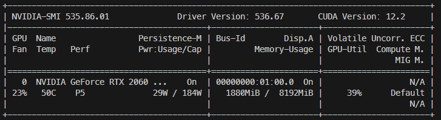
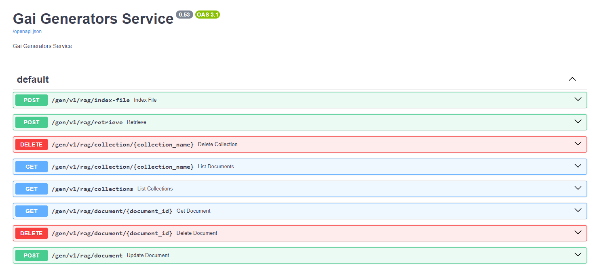

import ColoredText from "@site/src/components/ColoredText";

## Gai/Gen: Local LLM Library

Gai/Gen is a library optimized for a select number of open source language models that can serve as viable alternatives to proprietary ones. This makes it easier to create quality LLM applications with fewer resources.

The library can be used to develop single model API services known as **Gai Instances**.

For more complex scenarios, such as multi-modal application, retrieval-augmented generation or multi-agent chatbots, you may require a cluster of Gai Instances.

## Table of Contents

-   [Gai/Gen: Local LLM Application Development Library](#gai-gen-intro)
    -   [1. Introduction](##1-introduction)
    -   [2. Requirements](##2-requirements)

## 1. Introduction

The core object is called **Gaigen** - generative AI generator. The premise is for the code to run on as commonly available commodity hardware as possible. The main focus is on 7 billion parameters and below open source models. Gaigen is designed as singleton wrapper where only one model is loaded and cached into memory at any one time.

To avoid dependency conflicts, the wrappers are organised under the `gen` folder according to 6 mutually-exclusive categories:

-   ttt: Text-to-Text
-   tts: Text-to-Speech
-   stt: Speech-to-Text
-   itt: Image-to-Text
-   rag: Retrieval-Augmented Generation
-   ttc: Text-to-Code (In development)

## 2. Requirements

-   The instructions are tested mainly on:

    -   Windows 11 (22H2 Build 22621.3007) with WSL2 (5.12.133.1-microsoft-standard-WSL2)
    -   Ubuntu 20.04.2 LTS
    -   NVIDIA RTX 2060 GPU with 8GB VRAM. Run `nvidia-smi` to check if CUDA driver is installed.

    

    -   CUDA Toolkit 11.8 is required for the GPU accelerated models. Run `nvcc --version` to check if CUDA Toolkit is installed. Refer here https://gist.github.com/kakkoii1337/8a8d4d0bc71fa9c099a683d1601f219e if you need guidance.

## 3. Setting up virtual environments

Every category of Gai has its own package dependencies due to the particular requirements for each model. It is highly recommended to install each category in separate virtual environments using virtual environment manager such as `conda` or `venv`. For the purpose of this guide, we will use `conda` to create virtual environments.

The following table shows the recommended virtual environment names and the corresponding commands to install the Gai package.

| Category | Virtual Environment  | Command                                                                                                            |
| -------- | -------------------- | ------------------------------------------------------------------------------------------------------------------ |
| ttt      | `conda activate TTT` | `pip install "gai-lib-gen[TTT]"`                                                                                   |
| tts      | `conda activate TTS` | `pip install "gai-lib-gen[TTS]"`                                                                                   |
| stt      | `conda activate STT` | `pip install "gai-lib-gen[STT]"`                                                                                   |
| itt      | `conda activate ITT` | `pip install "gai-lib-gen[ITT]"&& git clone https://github.com/haotian-liu/LLaVA && cd LLaVA && pip install -e . ` |
| rag      | `conda activate RAG` | `pip install "gai-lib-gen[RAG]"`                                                                                   |

For example, setting up the virtual environment for the `ttt` category may look like this:

```bash
conda create -n TTT python=3.10.10 -y
conda activate TTT
pip install gai-lib-gen[TTT]
```

## 4. Setting up configuration and application directory

The application directory for Gai is at `~/.gai` by default and can be changed by setting the `app_dir` variable in the `.gairc` file.

The `.gairc` file is stored in your home directory and contains information such as location of the application directory, `app_dir`.

```json
{
    "app_dir": "~/.gai"
}
```

You can create the ~/.gai directory before running anything else.

Copy `gai.json` from this repository into `~/.gai`. This file contains the configurations for models and their respective loaders.

:::note
In Gai/Gen, the config file uses JSON format. The file is located at `~/.gai/gai.json`. The configuration describes how to load each Gai Instance.

In Gai/Lib, the config file uses YAML format. The file is located at `~/.gai/gai.yaml`. The configuration describes how to locate the Gai Instances.
:::

## 5. Downloading models

Models are downloaded into `~/.gai/models` directory.

```bash
mkdir ~/.gai/models
```

When downloading from huggingface model hub, it is recommended to use the [huggingface CLI](https://huggingface.co/docs/huggingface_hub/guides/download#download-from-the-cli).
You will need to install the CLI first.

```sh
pip install huggingface-hub
```

To download a model, run the following command:

```sh
huggingface-cli download <repo-name>/<model-name> --local-dir ~/gai/models/<model-name> --local-dir-use-symlinks False
```

**Example:** Downloading the main branch

```sh
huggingface-cli download TheBloke/Mistral-7B-Instruct-v0.1-GPTQ \
                --local-dir ~/gai/models/Mistral-7B-Instruct-v0.1-GPTQ \
                --local-dir-use-symlinks False
```

**Example:** Downloading 2 files

```sh
huggingface-cli download TheBloke/Mistral-7B-Instruct-v0.1-GGUF \
                mistral-7b-instruct-v0.1.Q4_K_M.gguf  \
                config.json \
                --local-dir ~/gai/models/Mistral-7B-Instruct-v0.1-GGUF \
                --local-dir-use-symlinks False
```

## 6. Final Structure

The final user directory structure looks like this:

```bash
home
├── .gai
│   ├── gai.json
│   ├── gai.yaml
│   └── models
└── .gairc
```

## 7. API Key

-   All API keys should be stored in a `.env` file in the root directory of the project.  
    For example,

    ```.env
    OPENAI_API_KEY=<--replace-with-your-api-key-->
    ANTHROPIC_API_KEY=<--replace-with-your-api-key-->
    ```

## 8. Quick Start

The quick start will walk through the process of setting up the virtual environment, installing the Gai package, setting up the API key, and running inferencing on GPT4 and Mistral7B.

**Step 1. Install virtal environment and Gai**

The following example shows how to install the TTT category but the same steps are applicable to the other categories as well.

```bash
conda create -n TTT python=3.10.10 -y
conda activate TTT
pip install gai-lib-gen[TTT]
```

**Step 2. Setup OpenAI API Key.**

Save your OpenAI API key in the **.env** file in the root directory of your project.

```bash
OPENAI_API_KEY=<--replace-with-your-api-key-->
```

**Step 3. Run Inferencing on GPT4.**

Run Text-to-Text generation using OpenAI by loading `gpt-4` wrapper.

```python
from gai.gen import Gaigen
gen = Gaigen.GetInstance().load('gpt-4')

response = gen.create(messages=[{'role':'USER','content':'Tell me a one paragraph short story.'},{'role':'ASSISTANT','content':''}])
print(response)
```

**Step 4. Install Mistral7B.**

Download the model `Mistral-7B-Instruct-v0.1-GPTQ` into the `~/gai/models` folder.

```json
huggingface-cli download TheBloke/Mistral-7B-Instruct-v0.1-GPTQ \
                --local-dir ~/gai/models/Mistral-7B-Instruct-v0.1-GPTQ \
                --local-dir-use-symlinks False
```

**Step 5. Run Inferencing on Mistral**

Run Text-to-Text generation using Mistral7B by replacing `gpt-4` with `mistral7b-exllama`.

```python
from gai.gen import Gaigen
gen = Gaigen.GetInstance().load('mistral7b-exllama')

response = gen.create(messages=[{'role':'USER','content':'Tell me a one paragraph short story.'},{'role':'ASSISTANT','content':''}])
print(response)
```

## 9. Using Gai as a Service

Gai Service is meant to be a one-model-per-instance service. Unlike library, you cannot change the model during runtime.

The easiest to run Gai Service is to use a Docker container. You will need to download the models into ~/gai/models and map the volume to the container. You can then start up a container and post REST API calls to following endpoints.

You can enable swagger UI by setting the environment variable `SWAGGER_URL` to `/doc`.

For example, to see the API specification of RAG, you can open the browser to `http://localhost:12031/doc`.



## 10. Examples

-   [Text-to-Text Generation (OpenAI GPT4 vs Open-Source Mistra7B)](/notebooks/gai-gen-TTT.ipynb)
-   [Speech-to-Text Generation (OpenAI Whisper vs Open-Source Whisper)](/notebooks/gai-gen-STT.ipynb)
-   [Text-to-Speech Generation (OpenAI Speech vs Open-Source xTTS)](/notebooks/gai-gen-TTS.ipynb)
-   [Image-to-Text Generation (OpenAI Vision vs Open-Source Llava)](/notebooks/gai-gen-ITT.ipynb)
-   [Retrieval Augmented Generation](/notebooks/gai-gen-RAG.ipynb)

## 11. API Reference

The following endpoints are only available for the category of models that you have installed.

### Text-to-Text (TTT)

Endpoint: http://localhost:12031/gen/v1/chat/completions

<ColoredText>POST</ColoredText>
Type: Body

| Name     | Type | Description                    | Default           |
| -------- | ---- | ------------------------------ | ----------------- |
| model    | str  | generator name                 | mistral7b-exllama |
| messages | list | See below                      |                   |
| stream   | bool | True, False                    | True              |
| ...      |      | Hyperparameters based on model |                   |

:::info
messages

```json
[
    { "role": "system", "content": system message },
    { "role": "user", "content": user message },
    { "role": "assistant", "content": AI message },
    ...
]
```

:::

### Text-to-Speech (TTS)

Endpoint: http://localhost:12031/gen/v1/audio/speech

<ColoredText>POST</ColoredText>
Type: Body

| Name     | Type | Description                    | Default |
| -------- | ---- | ------------------------------ | ------- |
| model    | str  | generator name                 | xtts-2  |
| input    | str  | text to be spoken              |         |
| voice    | str  | voice id (speaker)             |         |
| language | file | language code                  | en      |
| stream   | bool | True, False                    | True    |
| ...      |      | Hyperparameters based on model |         |

### Speech-to-Text (STT)

Endpoint: http://localhost:12031/gen/v1/audio/transcriptions

<ColoredText>POST</ColoredText>
Type: Multipart Form-Data

| Name  | Type | Description       | Default |
| ----- | ---- | ----------------- | ------- |
| model | str  | generator name    |         |
| file  | file | audio file object |         |

### Image-to-Text (ITT)

Endpoint: http://localhost:12031/gen/v1/vision/completions

<ColoredText>POST</ColoredText>
Type: Body Parameters:

| Name     | Type | Description                    | Default |
| -------- | ---- | ------------------------------ | ------- |
| model    | str  | generator name                 |         |
| messages | list | see below                      |         |
| stream   | bool | True,False                     |         |
| ...      |      | Hyperparameters based on model |         |

:::info
messages format

```json
[
    {
        "role": "user",
        "content": [
            {"type": "text", "text": text},
            {
                "type": "image_url",
                "image_url": {
                    "url": 'data:image/jpeg;base64,.....',
                },
            },
        ],
        ...
    }
]
```

:::

### Retrieval-Augmented Generation (RAG)

a) Endpoint: http://localhost:12031/gen/v1/rag/index_file

<ColoredText>POST</ColoredText>
Type: Multipart Form-Data Parameters:

| Name            | Type | Description                   | Default |
| --------------- | ---- | ----------------------------- | ------- |
| collection_name | str  | collection name in the store  |         |
| file            | file | the document to be indexed    |         |
| metadata        | dict | metadata tied to the document |         |

b) Endpoint: http://localhost:12031/gen/v1/rag/retrieve

<ColoredText>POST</ColoredText>
Type: Body Parameters:

| Name            | Type | Description                    | Default |
| --------------- | ---- | ------------------------------ | ------- |
| collection_name | str  | collection name in the store   |         |
| query_texts     | str  | query                          |         |
| n_results       | int  | no. of nearest result returned |         |
