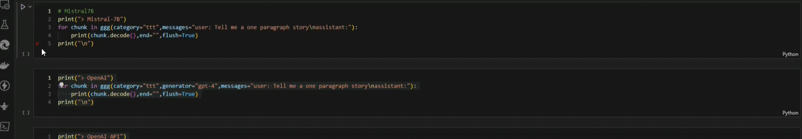
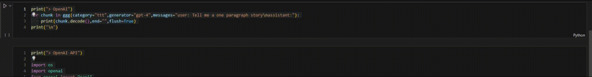
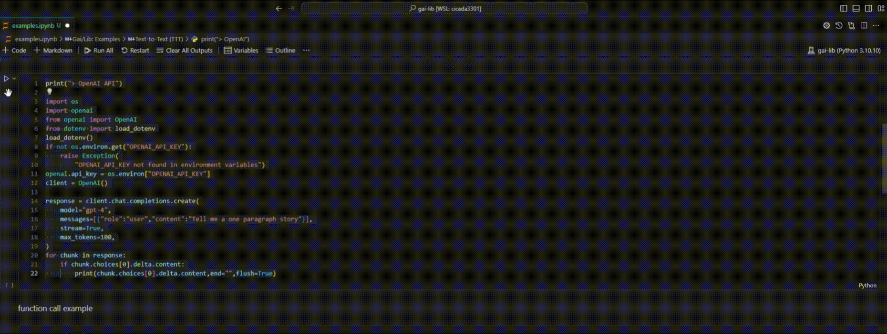
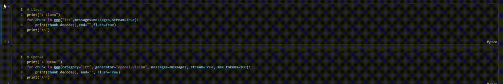
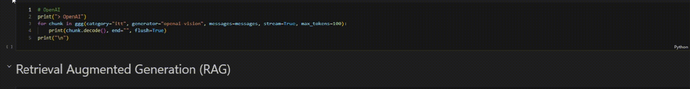
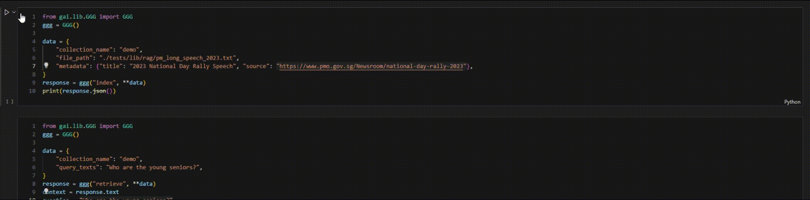

## Gai/Gen: Gai Client Library

**Gai Client Library** are client-side libraries for accessing Gai Services. You can choose to use Gai/Lib in an openai-compatible manner or use the Gai/Lib unified interface that is simpler and easier for access across all supported models.

## Table of Contents

-   [Gai/Lib: Universal LLM Wrapper Client](#Gai: LLM Application Development Library Suite)
    -   [1. Introduction](#1-introduction)

## Getting Started

### Setup

It is recommended to use a virtual environment such as `venv` or `miniconda` before installing the library to avoid any package conflict.
The following example shows how to install the `gai-lib` environment on miniconda.

```bash
conda create -n gai-lib python=3.10.10 -y
```

Switch to the virtual environment

```bash
conda activate gai-lib
```

While the virtual environment is activated, install Gai/Lib at the root of this repository.

```bash
pip install -e .
```

Save your OpenAI API key in the **.env** file in ~/gai/.env

```bash
OPENAI_API_KEY=<--replace-with-your-api-key-->
```

### Configuration

**Step 1.** Create a `.gairc` file in your home directory. This file contains the default configurations for Gai.

```bash
{
    "app_dir": "~/gai"
}
```

**Step 2.** Create a `/gai` directory and create `gai.yml`.

```bash
mkdir ~/gai
```

Copy the yaml file `gai.yml` from this repository into `~/gai`. This file contains the network configurations for connecting to each models.

eg.

```yaml
ttt:
    ...
    mistral7b-exllama:
        url: "https://gaiaio.ai/api/mistral7b-exllama/v1/chat"
        hyperparameters:
            temperature: 1.2
            top_p: 0.15
            min_p: 0.0
            top_k: 50
            max_new_tokens: 1000
            typical: 0.0
            token_repetition_penalty_max: 1.25
            token_repetition_penalty_sustain: 256
            token_repetition_penalty_decay: 128
            beams: 1
            beam_length: 1
    ...
stt:
    ...
    whisper-transformers:
        url: "https://gaiaio.ai/api/whisper-transformers/v1/audio"
tts:
    ...
    xtts-2:
        url: "https://gaiaio.ai/api/xtts-2/v1/audio"
itt:
    ...
    llava-transformers:
        url: "https://gaiaio.ai/api/llava-transformers/v1/vision"
rag:
    default: rag
    rag:
        url: "https://gaiaio.ai/api/rag/v1/chat"
```

**Step 3.** All API keys should be stored in a `.env` file in `~/gai` directory.

    For example,

    ```.env
    OPENAI_API_KEY=<--replace-with-your-api-key-->
    ANTHROPIC_API_KEY=<--replace-with-your-api-key-->
    ```

The final user directory structure should look like this:

```bash
home
├── gai
│   ├── .env
│   └── gai.yml
└── .gairc
```

---

### Examples

You only need **GGG** to perform all tasks below.

```python
from gai.lib.GGG import GGG
ggg = GGG()
```

### Text-to-Text (TTT)

#### Chat

Chat using Mistral-7B

```python
print("> Mistral-7B")
for chunk in ggg(category="ttt",messages="user: Tell me a one paragraph story\nassistant:"):
    print(chunk.decode(),end="",flush=True)
print("\n")
```



Chat using OpenAI GPT4

```python
print("> OpenAI")
for chunk in ggg(category="ttt",generator="gpt-4",messages="user: Tell me a one paragraph story\nassistant:"):
    print(chunk.decode(),end="",flush=True)
print("\n")
```



Chat using OpenAI's API

```python
print("> OpenAI API")

import os
import openai
from openai import OpenAI
from dotenv import load_dotenv
load_dotenv()
if not os.environ.get("OPENAI_API_KEY"):
    raise Exception(
        "OPENAI_API_KEY not found in environment variables")
openai.api_key = os.environ["OPENAI_API_KEY"]
client = OpenAI()

response = client.chat.completions.create(
    model="gpt-4",
    messages=[{"role":"user","content":"Tell me a one paragraph story"}],
    stream=True,
    max_tokens=100,
)
for chunk in response:
    if chunk.choices[0].delta.content:
        print(chunk.choices[0].delta.content,end="",flush=True)
```



#### Function Call

Function Call is one of the most powerful feature of GPT4 whereby the LLM can return a function call result that can be used by the user to execute an external function. In this example, we will demonstrate the original OpenAI API function call and function call for open source model.

First, create a list of tools for the LLM.

```python
# Load Tools
import json
with (open("./tests/lib/ttt/tools/tools.txt", "r")) as f:
    tools = json.load(f)
    print(json.dumps(tools, indent=4))

# Print Tool
def print_tool(response):
    tool = {}
    for chunk in response:
        decoded = chunk.decode()
        if "tool_name" in decoded:
            tool["tool_name"] = decoded[0]['tool_name']
        if "tool_arg" in decoded:
            tool["tool_arg"] = decoded[0]["tool_arg"]
    print(json.dumps(tool, indent=4)+"\n")
```

The tools will look like this.

```json
[
    {
        "type": "function",
        "function": {
            "name": "gg",
            "description": "Search google based on the provided search query",
            "parameters": {
                "type": "object",
                "properties": {
                    "search_query": {
                        "type": "string",
                        "description": "The search query to search google with"
                    }
                },
                "required": ["search_query"]
            }
        }
    },
    {
        "type": "function",
        "function": {
            "name": "scrape",
            "description": "Scrape the content of the provided url",
            "parameters": {
                "type": "object",
                "properties": {
                    "url": {
                        "type": "string",
                        "description": "The url to scrape the content from"
                    }
                },
                "required": ["url"]
            }
        }
    }
]
```

Run on Mistral-7B

```python
# Mistral7B
print("> Mistral-7B")
response = ggg(category="ttt",
               messages="user: Tell me the latest news on Singapore\nassistant:",
               tools=tools)
print_tool(response)
```

Run on OpenAI

```python
# OpenAI
print("> OpenAI")
response = ggg(category="ttt",
               messages="user: Tell me the latest news on Singapore\nassistant:",
               tools=tools)
print_tool(response)
```

Run on OpenAI using OpenAI's API

```python
print("> OpenAI Original")
response = client.chat.completions.create(
    model="gpt-4",
    messages=[{"role":"user","content":"Tell me the latest news on Singapore"}],
    stream=True,
    max_tokens=100,
    tools=tools
)
tool = {}
tool["tool_arg"]=""
for chunk in response:
    if chunk.choices[0].delta.tool_calls and chunk.choices[0].delta.tool_calls[0].function.name:
        tool["tool_name"] = chunk.choices[0].delta.tool_calls[0].function.name
    elif chunk.choices[0].delta.tool_calls and chunk.choices[0].delta.tool_calls[0].function.arguments:
        tool["tool_arg"] += chunk.choices[0].delta.tool_calls[0].function.arguments
print(json.dumps(tool, indent=4)+"\n")
```

All of the above examples will return the following:

```
{
    "tool_name": "gg",
    "tool_arg": "{ \"search_query\": \"latest news singapore\" }"
}
```

---

### Text-to-Speech (TTS)

Set up the following text as input

```python
from gai.common.sound_utils import play_audio

data = {
    "input": "The definition of insanity is doing the same thing over and over and expecting different results.",
    "voice": None,
    "language": None
}
```

#### Run coqui-tts

```python
# xtts
response = ggg("tts", **data)
play_audio(response)
```

<audio controls>
  <source src="./docs/audio/xtts.wav" type="audio/wav" />
Your browser does not support the audio element.
</audio>

#### Run OpenAI's TTS

```python
# openai tts
response = ggg("tts", generator="openai-tts-1", **data)
play_audio(response)
```

<audio controls>
  <source src="./docs/audio/openai-tts.wav" type="audio/wav" />
Your browser does not support the audio element.
</audio>

#### Run using OpenAI's API

```python
# openai original
response = client.audio.speech.create(
    model='tts-1', input="The definition of insanity is doing the same thing over and over and expecting different results.", voice="alloy")
play_audio(response.content)
```

---

### Speech-to-Text (STT)

Load Speech Sample

```python
# sample
with open("./tests/lib/stt/today-is-a-wonderful-day.wav", "rb") as f:
    play_audio(f.read())
```

<audio controls>
  <source src="./tests/lib/stt/today-is-a-wonderful-day.wav" type="audio/wav" />
Your browser does not support the audio element.
</audio>

Transcribe using OpenAI's open source Whisper model

```python
# OpenSource Whisper
with open("./tests/lib/stt/today-is-a-wonderful-day.wav", "rb") as f:
    output = ggg("stt", file=f)
    print(output.decode())
```

Transcribe using OpenAI's hosted Whisper model

```python
# OpenAI Whisper
with open("./tests/lib/stt/today-is-a-wonderful-day.wav", "rb") as f:
    output = ggg("stt", generator="openai-whisper", file=f)
    print(output.text)
```

---

### Image-to-Text (ITT)

Load Image Sample

```python
from gai.common.image_utils import read_to_base64
import os
from IPython.display import Image,display
image_file = os.path.join("./tests/lib/itt", "buses.jpeg")
encoded_string = read_to_base64(image_file)
messages = [
    {
        "role": "user",
        "content": [
            {"type": "text", "text": "What’s in this image?"},
            {
                "type": "image_url",
                "image_url": {
                    "url": f"data:image/jpeg;base64,{encoded_string}",
                },
            },
        ],
    }
]
```


Describe using Llava

```python
# Llava
print("> Llava")
for chunk in ggg("itt",messages=messages,stream=True):
    print(chunk.decode(),end="",flush=True)
print("\n")
```



Describe using OpenAI's Vision

```python
# OpenAI
print("> OpenAI")
for chunk in ggg(category="itt", generator="openai-vision", messages=messages, stream=True, max_tokens=100):
    print(chunk.decode(), end="", flush=True)
print("\n")
```



### RAG

Index a file (ie. chat with PDF)

```
data = {
    "collection_name": "demo",
    "file_path": "./tests/lib/rag/pm_long_speech_2023.pdf",
    "metadata": {"title": "2023 National Day Rally Speech", "source": "https://www.pmo.gov.sg/Newsroom/national-day-rally-2023"},
}
response = ggg("index", **data)
print(response.json())
```



Question and Answer

```python
data = {
    "collection_name": "demo",
    "query_texts": "Who are the young seniors?",
}
response = ggg("retrieve", **data)
context = response.text
question = "Who are the young seniors?"
answer = ggg("ttt", messages=f"user: Based on the context below: <context>{context}</context>, answer the question: {question}\nassistant:")
for chunk in answer:
    print(chunk.decode(), end="", flush=True)
```


## 6. API Endpoints

NOTE: You can choose to host your own model by referring to the instruction here [**Gai/Gen** Universal LLM Wrapper Services](https://github.com/kakkoii1337/gai-gen). The downside is that you need to ensure availability of your computing resources and you are not likely to capitalise on multiple model instances unless you are running a cluster of machines.

**- Text-to-Text (TTT)**  
Endpoint: https://gaiaio.ai/mistral7b-exllama/v1/chat/completions  
Method: POST  
Type: Body

| Name     | Type | Description                    | Default           |
| -------- | ---- | ------------------------------ | ----------------- |
| model    | str  | generator name                 | mistral7b-exllama |
| messages | list | See below                      |                   |
| stream   | bool | True, False                    | True              |
| ...      |      | Hyperparameters based on model |                   |

Note:

-   messages

```json
[
    { "role": "system", "content": system message },
    { "role": "user", "content": user message },
    { "role": "assistant", "content": AI message },
    ...
]
```

**- Text-to-Speech (TTS)**  
Endpoint: https://gaiaio.ai/xtts-2/v1/audio/speech  
Method: POST  
Type: Body

| Name     | Type | Description                    | Default |
| -------- | ---- | ------------------------------ | ------- |
| model    | str  | generator name                 | xtts-2  |
| input    | str  | text to be spoken              |         |
| voice    | str  | voice id (speaker)             |         |
| language | file | language code                  | en      |
| stream   | bool | True, False                    | True    |
| ...      |      | Hyperparameters based on model |         |

**- Speech-to-Text**
Endpoint: https://gaiaio.ai/whisper-transformer/v1/audio/transcription  
Method: POST  
Type: Multipart Form-Data

| Name  | Type | Description       | Default |
| ----- | ---- | ----------------- | ------- |
| model | str  | generator name    |         |
| file  | file | audio file object |         |

**- itt: Image-to-Text**
Endpoint: https://gaiaio.ai/llava/v1/vision/completions  
Method: POST
Type: Body
Parameters:

| Name     | Type | Description                    | Default |
| -------- | ---- | ------------------------------ | ------- |
| model    | str  | generator name                 |         |
| messages | list | see below                      |         |
| stream   | bool | True,False                     |         |
| ...      |      | Hyperparameters based on model |         |

Note:

-   messages format

```json
[
    {
        "role": "user",
        "content": [
            {"type": "text", "text": text},
            {
                "type": "image_url",
                "image_url": {
                    "url": 'data:image/jpeg;base64,.....',
                },
            },
        ],
        ...
    }
]
```

**- rag: Retrieval-Augmented Generation**

a) Endpoint: https://gaiaio.ai/rag/v1/rag/index_file  
Method: POST  
Type: Multipart Form-Data
Parameters:

| Name            | Type | Description                   | Default |
| --------------- | ---- | ----------------------------- | ------- |
| collection_name | str  | collection name in the store  |         |
| file            | file | the document to be indexed    |         |
| metadata        | dict | metadata tied to the document |         |

b) Endpoint: https://gaiaio.ai/rag/v1/rag/retrieve
Method: POST  
Type: Body
Parameters:

| Name            | Type | Description                    | Default |
| --------------- | ---- | ------------------------------ | ------- |
| collection_name | str  | collection name in the store   |         |
| query_texts     | str  | query                          |         |
| n_results       | int  | no. of nearest result returned |         |
